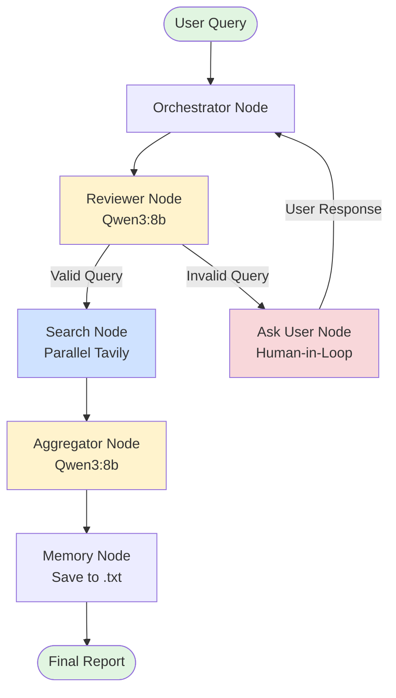
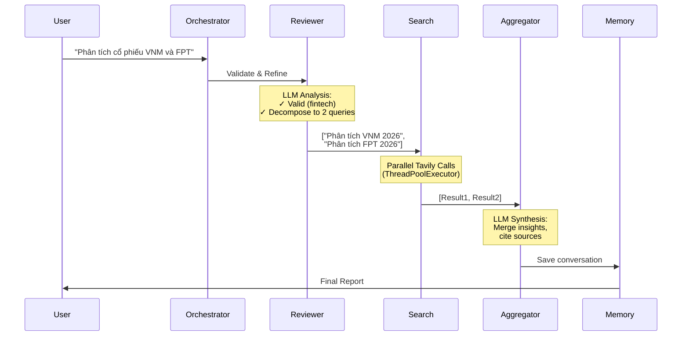
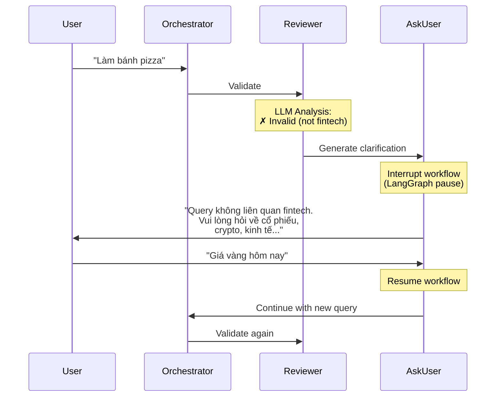

# Research Workflow Design - Fintech Agent

**Version:** 1.0  
**Date:** 2026-02-04  
**Status:** Design Complete - Ready for Implementation

---

## 📋 Executive Summary

This document describes the design for a **LangGraph-based Research Workflow** for the Fintech Agent. The system enables users to perform comprehensive financial research through an intelligent query processing pipeline with human-in-the-loop validation.

### Key Features
- ✅ Query validation and refinement using Qwen3:8b LLM
- ✅ Automatic query decomposition for complex requests
- ✅ Parallel Tavily API search execution
- ✅ LLM-powered result synthesis
- ✅ Human-in-the-loop for invalid queries
- ✅ Conversation persistence to text files

---

## 🏗️ Architecture Overview

### Workflow Diagram



---

## 🔄 Detailed Flow

### 1. Happy Path (Valid Query)



---

### 2. Invalid Query Flow (Human-in-Loop)



---

## 🧩 Component Specifications

### Node 1: Orchestrator

**Responsibility:** Entry point, flow coordination, iteration tracking

**Inputs:**
- `current_query` (str): User's query
- `messages` (list): Conversation history
- `conversation_id` (str, optional): Resume existing conversation

**Outputs:**
- `conversation_id` (str): UUID for this conversation
- `timestamp` (str): ISO format timestamp
- `iteration_count` (int): Human-in-loop iteration counter
- `next_step` (str): Routing decision

**Logic:**
1. Initialize conversation metadata (first run)
2. Track iteration count for monitoring
3. Route to Reviewer for validation

---

### Node 2: Reviewer

**Responsibility:** Query validation, refinement, decomposition

**LLM:** Qwen3:8b (Ollama, temperature=0)

**Inputs:**
- `current_query` (str): Query to validate

**Outputs:**
- `is_valid` (bool): Fintech relevance check
- `validation_message` (str): Feedback for user
- `refined_queries` (list[str]): Optimized sub-queries
- `next_step` (str): "search" or "ask_user"

**Tasks:**
1. **Validate:** Is query related to finance/stocks/crypto/economics?
2. **Refine:** Add context, fix ambiguity, optimize for search
3. **Decompose:** Break complex queries into sub-queries

**Example Transformations:**

| User Query | Validation | Refined Queries |
|------------|-----------|-----------------|
| "VNM" | ✓ Valid | ["Phân tích cổ phiếu VNM giá và tin tức mới nhất 2026"] |
| "So sánh VNM và FPT" | ✓ Valid | ["Phân tích cổ phiếu VNM 2026", "Phân tích cổ phiếu FPT 2026"] |
| "Làm bánh pizza" | ✗ Invalid | [] |
| "Giá vàng" | ✓ Valid | ["Giá vàng Việt Nam ngày 04/02/2026"] |

---

### Node 3: Search

**Responsibility:** Parallel Tavily API execution

**Inputs:**
- `refined_queries` (list[str]): Queries from Reviewer

**Outputs:**
- `search_results` (list[dict]): Tavily responses
- `next_step` (str): "aggregate"

**Implementation:**
- **Parallelization:** ThreadPoolExecutor (max_workers=5)
- **Error Handling:** Individual query failures don't crash workflow
- **No Limits:** Process all sub-queries (no cap)

**Result Format:**
```python
{
    "query": "Phân tích VNM 2026",
    "answer": "...",
    "sources": [
        {"title": "...", "url": "...", "content": "..."}
    ],
    "status": "success"  # or "failed"
}
```

---

### Node 4: Aggregator

**Responsibility:** Synthesize multiple search results

**LLM:** Qwen3:8b (Ollama, temperature=0.3)

**Inputs:**
- `search_results` (list[dict]): All Tavily results
- `original_query` (str): User's original question

**Outputs:**
- `final_report` (str): Markdown-formatted report
- `next_step` (str): "memory"

**Report Structure:**
```markdown
# [Report Title]

## Tóm tắt
[Brief overview answering original query]

## Phân tích Chi tiết
[Key findings from searches, synthesized]

## Nguồn Tham khảo
[List of sources with links]

## Kết luận
[Summary and insights]
```

---

### Node 5: Memory

**Responsibility:** Persist conversation to disk

**Inputs:**
- All state fields (conversation history, results, metadata)

**Outputs:**
- `memory_saved` (bool): Success status
- `memory_path` (str): File path
- `next_step` (str): "end"

**Storage:**
- **Location:** `conversations/` directory
- **Format:** `.txt` files
- **Naming:** `{conversation_id}_{timestamp}.txt`
- **Future:** Migrate to database

**File Content:**
```
================================================================================
FINTECH RESEARCH CONVERSATION
ID: abc-123-def
Timestamp: 2026-02-04T11:00:00
================================================================================

## CONVERSATION HISTORY

[HUMAN]: Phân tích VNM
[AI]: Query đã được refined...

================================================================================
## FINAL RESEARCH REPORT
================================================================================

[Aggregated report content]

================================================================================
## METADATA
================================================================================
Original Query: Phân tích VNM
Iterations: 0
Sub-queries: 1
Search Results: 1
```

---

### Node 6: Ask User

**Responsibility:** Human-in-the-loop clarification

**Inputs:**
- `validation_message` (str): Feedback from Reviewer
- `iteration_count` (int): Tracking

**Outputs:**
- `messages` (list): AI message asking for clarification
- `next_step` (str): "wait_user"

**Mechanism:**
- Uses LangGraph's `interrupt_before=["ask_user"]`
- Workflow pauses, waits for user response
- Resumes with new input via checkpointer

**Example Message:**
```
🤔 Query không liên quan đến tài chính.

Vui lòng cung cấp query liên quan đến:
- Cổ phiếu, chứng khoán
- Tiền điện tử (crypto)
- Tài chính, kinh tế, đầu tư
- Phân tích công ty, báo cáo tài chính

(Lần hỏi lại: 2)
```

---

## 📊 State Schema

```python
class ResearchState(TypedDict):
    """LangGraph state for research workflow"""
    
    # === Messages (LangGraph standard) ===
    messages: Annotated[Sequence[BaseMessage], add_messages]
    
    # === Query Tracking ===
    original_query: str          # User's initial query
    current_query: str           # Current iteration query
    iteration_count: int         # Human-in-loop counter
    
    # === Reviewer Outputs ===
    is_valid: bool               # Query validation result
    validation_message: str      # Feedback for user
    refined_queries: Annotated[list[str], add]  # Sub-queries
    
    # === Search Results ===
    search_results: Annotated[list[dict], add]  # Tavily responses
    
    # === Final Output ===
    final_report: str            # Aggregated report
    
    # === Metadata ===
    conversation_id: str         # UUID
    timestamp: str               # ISO timestamp
    
    # === Flow Control ===
    next_step: str               # Routing: "reviewer", "search", etc.
```

**Key Patterns:**
- `Annotated[..., add_messages]`: Append messages (don't overwrite)
- `Annotated[..., add]`: Accumulate lists
- `str` fields: Overwrite behavior (latest value)

---

## 🔀 Graph Routing Logic

### Conditional Edges

**From Orchestrator:**
```python
def route_from_orchestrator(state: ResearchState) -> str:
    return state.get("next_step", "reviewer")
```

**From Reviewer:**
```python
def route_from_reviewer(state: ResearchState) -> str:
    if state.get("is_valid"):
        return "search"
    else:
        return "ask_user"
```

**From Ask User:**
```python
def route_from_ask_user(state: ResearchState) -> str:
    return "orchestrator"  # Loop back for re-validation
```

### Edge Map

| Source Node | Condition | Target Node |
|------------|-----------|-------------|
| START | - | orchestrator |
| orchestrator | next_step="reviewer" | reviewer |
| orchestrator | next_step="end" | END |
| reviewer | is_valid=True | search |
| reviewer | is_valid=False | ask_user |
| search | - | aggregator |
| aggregator | - | memory |
| memory | - | END |
| ask_user | - | orchestrator |

---

## 🛠️ Technology Stack

| Component | Technology | Version |
|-----------|-----------|---------|
| **Framework** | LangGraph | latest |
| **LLM** | Qwen3:8b (Ollama) | 3.0 |
| **Search API** | Tavily | latest |
| **State Management** | LangGraph AgentState | - |
| **Parallelization** | ThreadPoolExecutor | Python stdlib |
| **Memory** | Text files (.txt) | - |
| **Checkpointer** | MemorySaver | LangGraph |

---

## 📝 Decision Log

### Performance & Caching
**Decision:** Focus on performance optimization, defer caching implementation  
**Rationale:** Core functionality first, caching adds complexity. Historical research data = cache-friendly for future.

### LLM Choice
**Decision:** Qwen3:8b via Ollama (local)  
**Alternatives:** OpenAI GPT-4, Anthropic Claude  
**Rationale:** Local deployment, no API costs, privacy control, sufficient capability for validation/synthesis

### Architecture Pattern
**Decision:** 5-node separation (Orchestrator, Reviewer, Search, Aggregator, Memory)  
**Alternatives:** Monolithic node, ToolNode pattern  
**Rationale:** Clear separation of concerns, single responsibility per node, easier debugging/extension

### Human-in-Loop
**Decision:** LangGraph `interrupt_before` with unlimited iterations  
**Alternatives:** Manual loop, limited iterations, best-effort auto-correction  
**Rationale:** Built-in state management, proper resume mechanism, better UX until query valid

### Sub-query Execution
**Decision:** Parallel execution, no limits  
**Alternatives:** Sequential, limited to 3-5, smart conditional  
**Rationale:** Research use case tolerates many queries, parallel faster, comprehensive results

### Conversation Memory
**Decision:** Text files initially, migrate to database later  
**Alternatives:** Database immediately, no persistence, JSON files  
**Rationale:** Simple implementation, easy inspection/debugging, explicit migration path

---

## 🚀 Implementation Plan

### Phase 1: Core Nodes (Priority: High)
- [ ] Implement `ResearchState` TypedDict
- [ ] Implement `orchestrator_node`
- [ ] Implement `reviewer_node` with Qwen3:8b
- [ ] Implement `search_node` with parallel Tavily
- [ ] Implement `aggregator_node` with LLM synthesis
- [ ] Implement `memory_node` with .txt persistence

### Phase 2: Graph Assembly (Priority: High)
- [ ] Create `create_research_workflow()` function
- [ ] Add all nodes to graph
- [ ] Implement conditional routing logic
- [ ] Configure checkpointer and interrupt_before
- [ ] Test basic flow end-to-end

### Phase 3: Human-in-Loop (Priority: Medium)
- [ ] Implement `ask_user_node`
- [ ] Test interrupt mechanism
- [ ] Implement resume logic
- [ ] Add iteration tracking

### Phase 4: Integration (Priority: Medium)
- [ ] Integrate with existing `TavilySearch` tool
- [ ] Update project structure (move old nodes if needed)
- [ ] Add logging throughout workflow
- [ ] Create CLI/API interface for testing

### Phase 5: Testing & Refinement (Priority: Low)
- [ ] Test with various query types
- [ ] Test human-in-loop edge cases
- [ ] Validate memory persistence
- [ ] Performance benchmarking
- [ ] Error handling edge cases

### Phase 6: Future Enhancements (Deferred)
- [ ] Implement Redis caching
- [ ] Migrate memory to database
- [ ] Add metrics/monitoring
- [ ] Query similarity detection
- [ ] Multi-source search integration

---

## 📂 File Structure

```
BE/
├── src/
│   └── finance_agent/
│       ├── graph/
│       │   ├── __init__.py
│       │   ├── state.py              # ResearchState definition
│       │   ├── nodes/
│       │   │   ├── __init__.py
│       │   │   ├── orchestrator.py   # Orchestrator node
│       │   │   ├── reviewer.py       # Reviewer node (LLM)
│       │   │   ├── search.py         # Search node (Tavily)
│       │   │   ├── aggregator.py     # Aggregator node (LLM)
│       │   │   ├── memory.py         # Memory node
│       │   │   └── ask_user.py       # Ask user node
│       │   ├── edges.py              # Routing logic
│       │   └── workflow.py           # Graph assembly
│       ├── tools/
│       │   └── research.py           # TavilySearch (existing)
│       └── utils/
│           └── logger.py
├── conversations/                     # Memory storage
│   └── [uuid]_[timestamp].txt
└── docs/
    └── research_workflow_design.md    # This document
```

---

## 🔍 Testing Scenarios

### Scenario 1: Simple Valid Query
**Input:** "Giá vàng hôm nay"  
**Expected:**
- Reviewer: Valid
- Refined: ["Giá vàng Việt Nam ngày 04/02/2026"]
- Search: 1 Tavily call
- Output: Report with gold prices

### Scenario 2: Complex Query with Decomposition
**Input:** "So sánh VNM và FPT"  
**Expected:**
- Reviewer: Valid, decompose
- Refined: ["Phân tích VNM...", "Phân tích FPT..."]
- Search: 2 parallel Tavily calls
- Output: Comparative report

### Scenario 3: Invalid Query with Human-in-Loop
**Input:** "Làm bánh pizza"  
**Expected:**
- Reviewer: Invalid
- Ask User: Display clarification
- Wait for input
- User: "Giá Bitcoin"
- Resume: Validate new query → Search

### Scenario 4: Vague Query Refinement
**Input:** "VNM"  
**Expected:**
- Reviewer: Valid but vague
- Refined: ["Phân tích cổ phiếu VNM giá và tin tức mới nhất 2026"]
- Search: 1 Tavily call with improved query

---

## 🎯 Success Criteria

- ✅ Query validation accuracy > 95% for fintech vs non-fintech
- ✅ Query refinement improves search relevance (manual evaluation)
- ✅ Parallel search completes in < 5 seconds for 3 sub-queries
- ✅ Human-in-loop works smoothly (pause/resume)
- ✅ Conversation memory persists correctly
- ✅ Final reports are coherent and cite sources
- ✅ Zero crashes on error cases (graceful degradation)

---

## 📌 Assumptions

1. Ollama server running locally with Qwen3:8b model
2. Tavily API key configured in environment
3. Python 3.9+ with LangGraph dependencies
4. File system has write permissions for `conversations/` dir
5. Users interact via CLI or API (frontend handled separately)

---

## 🔮 Future Considerations

### Caching Layer (Deferred)
- Redis for shared cache between workers
- Query normalization for cache keys
- Semantic similarity detection
- TTL strategy for different data types

### Database Migration
- PostgreSQL for conversation history
- Query analytics
- User tracking
- Performance metrics

### Advanced Features
- Multi-language support (English financial terms)
- PDF report generation
- Email delivery
- Scheduled research jobs

---

## 📞 Contact & Maintenance

**Design Owner:** Fintech Agent Team  
**Last Updated:** 2026-02-04  
**Next Review:** After Phase 2 implementation

---

**End of Design Document**
